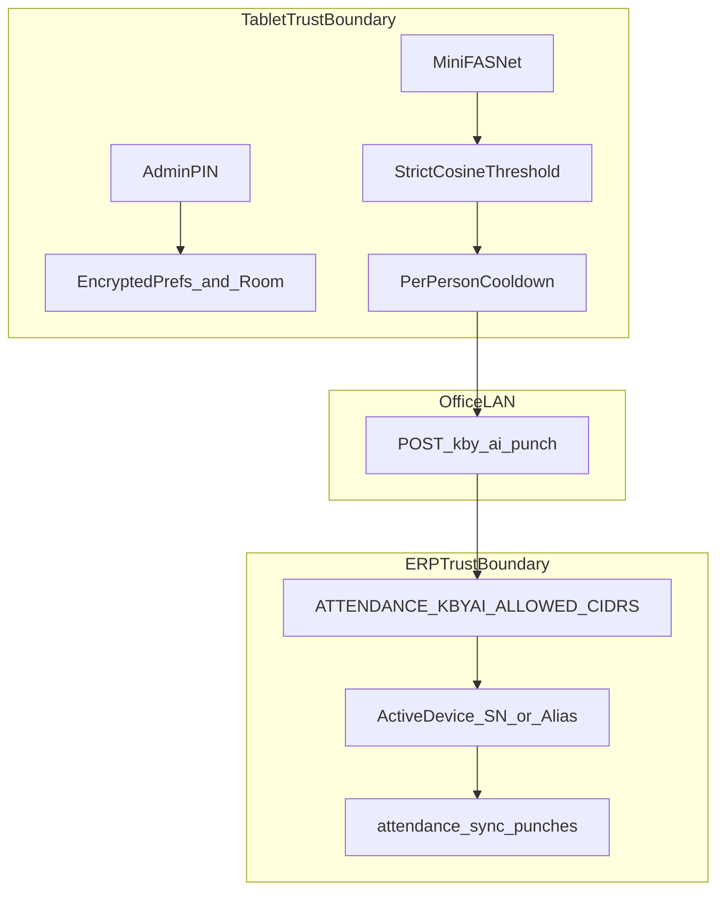
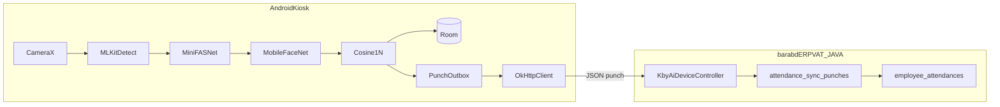

# Face Attendance Kiosk (Open-Source) — Delivery Plan

## 1. Executive summary

Build **`barabd-face-attendance-kiosk`**: a simple Android tablet app — Wi‑Fi on the device, operator enters **Server URL+port** and a **PIN**, then enroll/identify faces on-device and punch the ERP bridge. Open-source ML only; APK from GitHub Actions.

**Outcome:** Office face punch works end-to-end against Attendance Sync / today list, parallel to ZKTeco ADMS.

## 2. Locked decisions

| Decision | Choice |
| --- | --- |
| Platform | Native Android, Kotlin, minSdk 26, CameraX, TFLite |
| Repository | Separate GitHub repo `barabd-face-attendance-kiosk` (not inside `barabdERPVAT-JAVA`) |
| Application ID | `com.barabd.facekiosk` |
| ML stack | ML Kit Face Detection + MobileFaceNet + MiniFASNet (vendored `.tflite` in assets) |
| ERP integration | Existing public bridge `POST /kby-ai/punch` + `GET /kby-ai/health` |
| Device register (ERP UI) | Vendor = `other`; Alias = Device ID; Terminal SN = tablet serial |
| **UX principle** | **Keep it simple** — few screens, few fields, large buttons; no clutter |
| **Network** | Tablet joins office **Wi‑Fi** (Android system settings); app does not manage Wi‑Fi |
| **Server config** | Operator enters **one Server Base URL including port** (e.g. `http://10.111.47.233:8080`) |
| **Admin PIN** | Single PIN for Settings / Enroll / exit kiosk — operator sets their own PIN |
| APK build (primary) | **GitHub Actions** — push/tag → downloadable APK artifact |
| APK build (fallback) | Local Android Studio debug only |
| CI trigger | `push` to `main` + tags `v*` + `workflow_dispatch` |
| Signing in CI | Keystore via GitHub Secrets when ready; until then debug APK from Actions |
| Face data | Embeddings + small thumbnail on-device only; never upload images to ERP |
| Repo visibility | **Private** GitHub repo |
| Local path | Sibling folder, e.g. `D:\Project12\barabd-face-attendance-kiosk` |
| Timezone | Device local time `yyyy-MM-dd HH:mm:ss` |
| Versioning | SemVer; tags `v*` build release/debug APK in CI |

## 3. Context (already verified in ERP)

- Bridge: [`KbyAiDeviceController.java`](erp-backend/src/main/java/com/barabd/erp/modules/attendance/controller/KbyAiDeviceController.java)
- Parser: [`KbyAiPunchParser.java`](erp-backend/src/main/java/com/barabd/erp/modules/attendance/service/KbyAiPunchParser.java) — accepts `device_id`, `person_id` / `attendance_code`, `time`, `punch_type`, `similarity`
- Runbook: [`docs/System/hr-and-payroll/attendance-kby-ai.md`](docs/System/hr-and-payroll/attendance-kby-ai.md)
- Flow: punch → `attendance_sync_punches` → rollup → `employee_attendances`
- Env: `ATTENDANCE_KBYAI_ENABLED=true`; harden with `ATTENDANCE_KBYAI_ALLOWED_CIDRS`
- KBY-AI GitHub demos wrap a closed `facesdk.aar` — unsuitable as a dependency
- ZKTeco `/iclock` path remains untouched

## 4. Goals and non-goals

### Goals (v1)

- Reliable on-device identify for enrolled staff on a fixed office tablet
- Secure punch path into ERP without third-party face license cost
- Operator can enroll by `attendance_code`, run kiosk mode, and verify punches in ERP UI
- Documented, repeatable APK build and tablet commissioning

### Non-goals

- Training or selling a proprietary face SDK
- iOS / browser punch
- Central multi-tablet face gallery sync
- Replacing ADMS / fingerprint terminals
- HR/leave/payroll logic inside the app
- Public Play Store listing
- Uploading biometric images to cloud or ERP

## 5. Security architecture (mandatory)



| Layer | Control |
| --- | --- |
| Privacy | No face bitmap/base64 in punch JSON; templates stay on device |
| Admin | PIN required for Settings, Enroll, People delete, exit kiosk |
| Anti-spoof | MiniFASNet before match; reject below liveness threshold |
| Match quality | Single face, frontal pose, blur/brightness gate; identify threshold default 0.80 |
| Abuse | Per-person punch cooldown (default 60s); outbox dedupe by person+minute |
| Transport | Network security config: cleartext only for private LAN CIDRs; prefer HTTPS when ERP is TLS-terminated |
| ERP | Active device registration + CIDR allowlist on punch bridge |
| Supply chain | Vendored models with `MODELS.md` hashes/attribution; no random model URLs at runtime |
| Release | App signed with project keystore (keystore file never committed; CI uses GitHub secret) |

## 6. System architecture



### On-device inference pipeline

1. CameraX frame → ML Kit face detect (exactly one face)
2. Quality gate (size, pose, blur/brightness)
3. MiniFASNet liveness score ≥ threshold
4. Crop → MobileFaceNet embedding
5. Cosine 1:N vs Room templates ≥ identify threshold
6. Cooldown check → enqueue punch → POST ERP (or retry from outbox)

### Punch contract

```http
POST {baseUrl}/kby-ai/punch
Content-Type: application/json

{
  "device_id": "head-office",
  "person_id": "101",
  "time": "2026-09-06 09:05:00",
  "punch_type": "check_in",
  "similarity": 0.87
}
```

`person_id` = Employee `attendance_code` in ERP. `device_id` = Attendance Device Alias (fallback SN supported by parser).

## 7. Repository structure

```text
barabd-face-attendance-kiosk/
  app/src/main/java/com/barabd/facekiosk/
    ui/          IdentifyActivity, EnrollActivity, SettingsActivity, PeopleActivity, PinDialog
    camera/      CameraX controller + analyzer
    ml/          FaceDetector, QualityGate, LivenessChecker, EmbeddingExtractor, FaceMatcher
    data/        AppDatabase, PersonEntity, PunchOutboxEntity, DAOs
    net/         PunchApiClient, HealthClient
    security/    PinStore, NetworkSecurity helpers
    settings/    KioskPreferences
  app/src/main/assets/models/
    mobile_face_net.tflite
    minifasnet_anti_spoof.tflite
  .github/workflows/android-apk.yml
  docs/SETUP.md
  docs/SECURITY.md
  docs/MODELS.md
  docs/ACCEPTANCE.md
  README.md
```

## 8. Functional modules (v1 — keep simple)

**Operator mental model (only three setup ideas):**

1. Connect tablet to **Wi‑Fi** (Android Settings — outside the app)
2. In app Settings: paste **Server URL with port**
3. Set / enter **PIN** when changing settings or enrolling

No separate “advanced” panel in v1. Thresholds and cooldown use safe built-in defaults (not shown unless a single “Advanced” is unavoidable later — **not in v1**).

| Module | Behavior |
| --- | --- |
| Home / Kiosk | Big **Start attendance** (Identify); small gear for Settings (PIN) |
| Settings (PIN) | **Server Base URL** (with port), **Device ID**, **Terminal SN**, **Change PIN**, Test connection (health), optional check_in/check_out toggle |
| Enroll (PIN) | attendance_code + name → face capture → save |
| Identify | Fullscreen camera; success/fail message only |
| People (PIN) | List + delete |

**Settings fields — keep minimal:**

| Field | Example | Notes |
| --- | --- | --- |
| Server Base URL | `http://10.111.47.233:8080` | One box; include `http://` and port; app appends `/kby-ai/...` |
| Device ID | `head-office` | = ERP Alias |
| Terminal SN | tablet serial | = ERP Terminal SN |
| PIN | operator-chosen | Required to open Settings/Enroll/People/exit kiosk |

**Not in Settings UI (v1):** Wi‑Fi SSID/password manager, CIDR editor, model picker, similarity slider, multi-server profiles, cloud sync.

## 9. ERP monorepo touch (docs only)

Update [`docs/System/hr-and-payroll/attendance-kby-ai.md`](docs/System/hr-and-payroll/attendance-kby-ai.md):

- State that open-source kiosk `com.barabd.facekiosk` uses the same bridge
- Commissioning steps: enable flag, CIDR, register device (vendor `other`), align `attendance_code`
- Point to kiosk repo `docs/SETUP.md`

No Java API redesign in v1.

## 10. Pre-implementation — new directory / new repository

Do this **before** writing feature code. Work happens in a **separate folder and Cursor window**, not inside `barabdERPVAT-JAVA`.

### 10.1 Create location and remote

```text
D:\Project12\barabdERPVAT-JAVA          ← existing ERP (do not put Android app here)
D:\Project12\barabd-face-attendance-kiosk   ← NEW repo root (recommended)
```

1. Create folder `D:\Project12\barabd-face-attendance-kiosk`
2. Create **private** GitHub repo `barabd-face-attendance-kiosk` under your org/user
3. Open that folder in Android Studio → New Project → Empty Activity (Kotlin, Groovy or Kotlin DSL Gradle)
4. Set `applicationId` = `com.barabd.facekiosk`
5. `git init` / connect `origin` / first commit of skeleton
6. Open **that folder** in Cursor for implementation (separate from ERP workspace)

### 10.2 Developer machine prerequisites

| Tool | Requirement |
| --- | --- |
| Android Studio | Hedgehog or newer |
| JDK | 17 |
| Android SDK | API 34 compile; minSdk 26 |
| Device/emulator | Physical tablet with front camera preferred (emulator weak for face/liveness) |
| Network | Tablet and ERP on same LAN (or routed); can reach `http://<erp-ip>:8888` or `:8080` |

### 10.3 Git hygiene (commit from day one)

Ignore and never commit:

- `local.properties`
- `*.jks` / `*.keystore` / `keystore.properties`
- `.idea/` machine-specific noise (keep shared run configs if useful)
- Enrolled face DBs / exports with real employee biometrics

Keep: source, vendored `.tflite`, docs, CI workflow, `.gitignore`.

### 10.4 ERP readiness (separate repo, same day)

In `barabdERPVAT-JAVA` (ops, not kiosk code):

1. `ATTENDANCE_KBYAI_ENABLED=true` → restart backend
2. Prefer set `ATTENDANCE_KBYAI_ALLOWED_CIDRS` to office LAN
3. Attendance Devices → create Alias + Terminal SN, vendor `other`, Active
4. Employee `attendance_code` ready for enroll tests
5. Smoke: `GET /kby-ai/health` and sample `POST /kby-ai/punch` from PC

### 10.5 Cross-repo workflow

| Repo | Owns |
| --- | --- |
| `barabd-face-attendance-kiosk` | Android app, models, kiosk docs, APK CI |
| `barabdERPVAT-JAVA` | Punch bridge, device registry, rollup, one runbook cross-link |

When kiosk is stable, open ERP repo once and add the short note to `attendance-kby-ai.md` (Phase 4).

### 10.6 Hardware / kiosk SOP (mention in SETUP.md)

- Fixed wall/desk mount; avoid strong backlight behind user
- Front camera; keep lens clean
- Android screen lock + kiosk admin PIN
- One tablet ↔ one ERP device row (do not clone Alias across sites)

### 10.7 Privacy / HR (mention in SECURITY.md)

- Inform staff that face templates are stored **on the tablet** for attendance only
- No face images sent to ERP
- On tablet wipe/replace: re-enroll (or restore encrypted backup if Phase 4 backup shipped)
- Align with company IT policy before production rollout

### 10.8 Default configuration values (hidden from simple UI)

| Pref | Default | Visible in Settings? |
| --- | --- | --- |
| Server Base URL | empty until operator enters | Yes |
| Device ID / SN | empty until operator enters | Yes |
| Admin PIN | empty → first Settings open asks to **create PIN** | Yes (change PIN) |
| Identify threshold | `0.80` | No (built-in) |
| Liveness threshold | `0.50` (tune in code/docs if needed) | No |
| Punch cooldown | `60` seconds | No |
| Punch type | `check_in` | Simple toggle only |

### 10.8a Commissioning story (simple)

```text
1. Tablet → Android Wi‑Fi → office network
2. Install APK from GitHub Actions
3. Open app → Settings → create PIN
4. Enter Server URL with port (e.g. http://10.111.47.233:8080)
5. Enter Device ID + Terminal SN (same as ERP Attendance Device)
6. Tap Test connection → OK
7. Enroll employees (attendance_code)
8. Start attendance (kiosk)
```

### 10.9 Troubleshooting cheat-sheet (docs)

| Symptom | Check |
| --- | --- |
| Health fail | ERP up? correct LAN IP/port? `ATTENDANCE_KBYAI_ENABLED`? |
| 403 punch | Device Alias/SN Active in ERP? CIDR allowlist? |
| Punch OK, no today row | Employee `attendance_code` mismatch; rollup flag |
| Always “unknown” | Re-enroll lighting; lower threshold carefully; one face only |
| Always “spoof” | Tune liveness; avoid screen glare; real face distance |
| Works on Wi‑Fi A not B | Different subnet vs ERP / CIDR |

### 10.10 Model acquisition note

Vendored TFLite files must be copied into `app/src/main/assets/models/` from **documented Apache-compatible sources** (MobileFaceNet + MiniFASNet / Silent-Face lineage). Record URL, license, and SHA-256 in `docs/MODELS.md` before release. Do not download models from unknown mirrors at runtime.

## 11. Phased delivery

### Phase 0 — Bootstrap (new folder)

- Sibling directory + private GitHub remote + Android empty project
- README links this plan; `.gitignore` for secrets/keystore
- Confirm Gradle assembleDebug on device/emulator

**Exit criteria:** repo clones clean; app launches with placeholder UI.

### Phase 1 — Foundation and ERP connectivity

- Settings + PIN + OkHttp health/manual test punch
- Confirm punch appears in Attendance Sync

**Exit criteria:** curl-equivalent success from app; 403 when device unregistered.

### Phase 2 — Recognition core

- ML Kit + MobileFaceNet + Room match
- Enroll / Identify / People
- Quality gates; punch JSON includes `similarity`

**Exit criteria:** enrolled person punches; unknown face does not punch.

### Phase 3 — Liveness and hardening

- MiniFASNet gate; cooldown; outbox retry
- Kiosk lock (PIN to exit); 3-shot enroll; spoof/unknown/server error UX

**Exit criteria:** printed photo rejected in office test; offline punch flushes after reconnect.

### Phase 4 — Release and operations (APK via GitHub Actions)

Primary way to get an installable APK: **code → GitHub → Actions → download artifact** (not manual Studio export).

Deliverables:

- `.github/workflows/android-apk.yml`
  - JDK 17 + Android SDK
  - `./gradlew assembleRelease` (or `assembleDebug` until secrets exist)
  - Upload `app-release.apk` / `app-debug.apk` as workflow artifact (retention ≥ 14 days)
  - On tag `v*`: same build + rename artifact to `facekiosk-<tag>.apk`
- GitHub Secrets (for signed release):
  - `KEYSTORE_BASE64` (or uploaded keystore)
  - `KEYSTORE_PASSWORD`, `KEY_ALIAS`, `KEY_PASSWORD`
- `docs/SETUP.md` section: “Download APK from Actions → enable Unknown sources → install”
- ERP runbook note; tablet commission on LAN (`8888` local / `10.111.47.233:8080` prod)

**Exit criteria:** Push to `main` (or tag) produces a downloadable APK; operator installs that CI APK and completes smoke checklist without Android Studio.

### CI workflow sketch (lock this shape)

```yaml
# .github/workflows/android-apk.yml
# on: push to main, tags v*, workflow_dispatch
# jobs:
#   build:
#     runs-on: ubuntu-latest
#     steps: checkout → setup-java 17 → setup Android SDK →
#            decode keystore from secrets (release) →
#            gradlew assembleRelease → upload-artifact
```

Until release secrets are configured, CI ships **debug APK** so you can still install from Actions; switch job to signed release once secrets are set.

## 12. Test and acceptance

| Test | Pass rule |
| --- | --- |
| Health | Returns `bridge: kby-ai` when enabled |
| Happy path | Enroll code `101` → identify → Sync row + today present/late |
| Spoof | Phone/print photo → no punch |
| Unknown | Unenrolled face → no punch |
| Cooldown | Second punch within 60s suppressed |
| Device ACL | Wrong Alias/SN → HTTP 403 |
| Offline | Kill Wi‑Fi mid-punch → outbox → recovers |
| Privacy | Proxy/log shows no image payload |

## 13. Risks and mitigations

| Risk | Mitigation |
| --- | --- |
| Open-source accuracy below commercial SDK | Strict threshold + multi-shot enroll + office lighting SOP |
| Public exposure of JWT-less punch API | Mandatory CIDR + device allowlist; never expose 8080 to WAN without reverse-proxy controls |
| Tablet theft / enroll abuse | Device lock screen + admin PIN + physical kiosk mount |
| Model license mistakes | Document Apache/compatible sources in `MODELS.md` before ship |
| False accept twins/lookalikes | Threshold 0.80+; re-enroll guidance; escalate threshold if needed |

## 14. Success definition

v1 is done when CI builds an installable APK from the kiosk repo, a commissioned tablet enrolls staff by `attendance_code`, rejects common spoofs, posts punches to ERP without any KBY-AI license, and operators install from **GitHub Actions artifacts** (not Studio) using repo docs.

## 15. Your next actions (today)

1. Create `D:\Project12\barabd-face-attendance-kiosk` (or preferred sibling path)
2. Create **private** GitHub repository with the same name
3. Android Studio → Empty Activity → `com.barabd.facekiosk`
4. Push skeleton to GitHub (Actions workflow can be added in Phase 1 skeleton or Phase 4 — prefer early stub that builds debug APK)
5. Open **that folder** in a new Cursor window
6. Implement Phase 0 → 1; confirm first **Actions → Artifacts → APK** download works
7. Confirm ERP `ATTENDANCE_KBYAI_ENABLED=true` and a test Attendance Device before first punch test

### Operator APK path (target)

```text
git push / tag
  → GitHub Actions build
  → Artifacts → facekiosk-*.apk
  → install on tablet
  → Wi‑Fi connect (Android)
  → Settings: create PIN + Server URL:port + Device ID/SN
  → Test connection → Enroll → Start attendance
```
